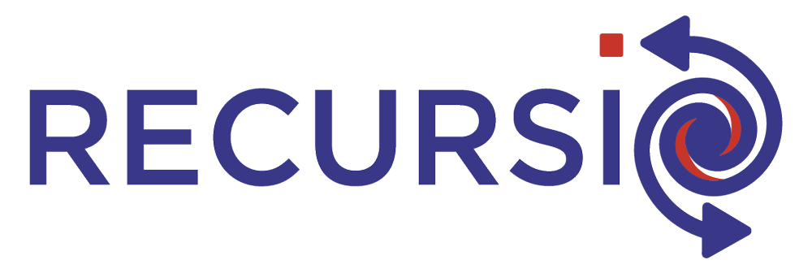
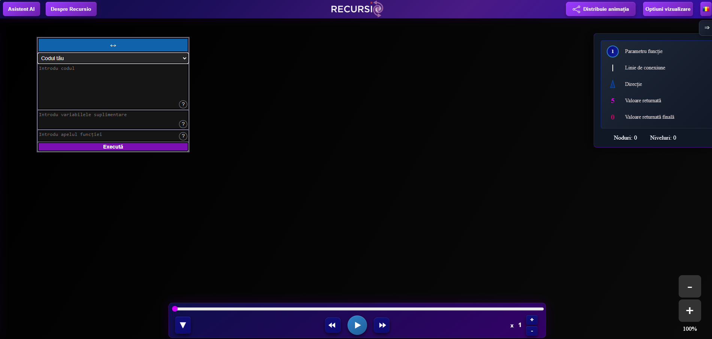
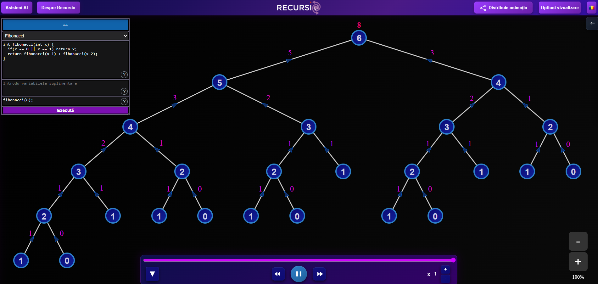
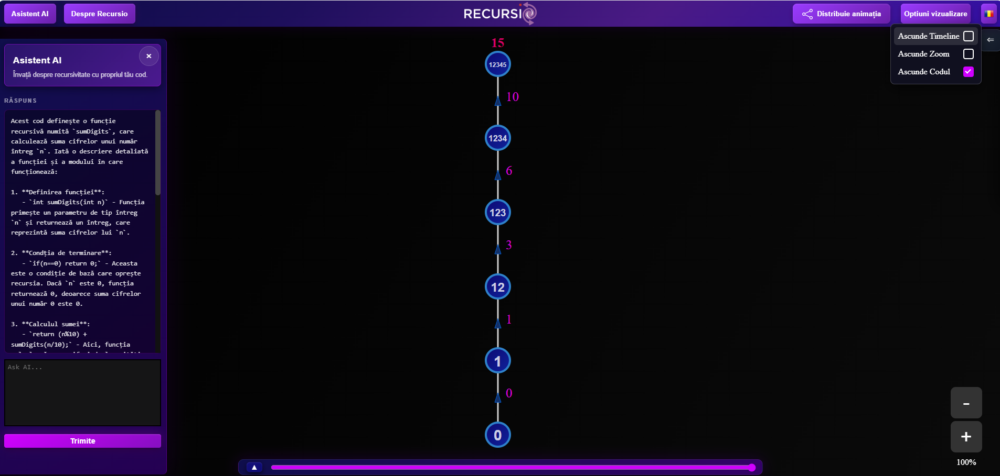

    

<b>Recursio</b> este o aplicație web construită cu scopul de a ajuta elevii (și nu numai!) să învețe cum funcționează conceptul de funcții recursive prin intermediul animațiilor și ajutorului dat de către inteligența artificială.
 
Vă invităm să ne vizitați pe [recursio.ro](https://recursio.ro)

## Features

* Animație a codului C++ introdus
* Asistent AI
* Timeline cu start/stop, derulare și viteză ajustabilă
* Zoom in/out pe animație
* Sistem de share între utilizatori
* Multiculturalism, limbi multiple (română, engleză, maghiară)
* Mesaje de compilare și de return
* Legendă cu tutorial de folosire
* Versiune pentru dispozitive mobile (nou de la etapa județeană!)
* Interfață customizabilă
* Fereastră plutitoare

## Prezentare

## Cerințe de sistem

* Browser modern (Google Chrome, Mozilla Firefox sau Apple Safari)
* Conexiune la internet
* Rezoluție de minim 800x600 pentru o experiență placută

## Tehnologii

### Front-end 
HTML, CSS și JavaScript (vanilla)

### Back-end
PHP, AJAX, Bash Script și C++ 

Aplicația noastră incorporează inteligența artificială prin modelul gpt-5.4-nano de la OpenAI, un model nou și sofisticat care este capabil de a înțelege și face sarcini în legătură cu programarea și informatica.

## Documentație tehnică
[Documentație](RECURSIO.pdf)

## Licență
[Licență](LICENSE.txt)

## Autori
<b>Voie Tudor</b> - back-end, automatizări, AI engineer, securitate și mentenanță server
 
<b>Banc Mark-Daniel</b> - front-end, UI/UX Design, prelucrarea și transformarea unui stack trace într-o animație propriu-zisă
